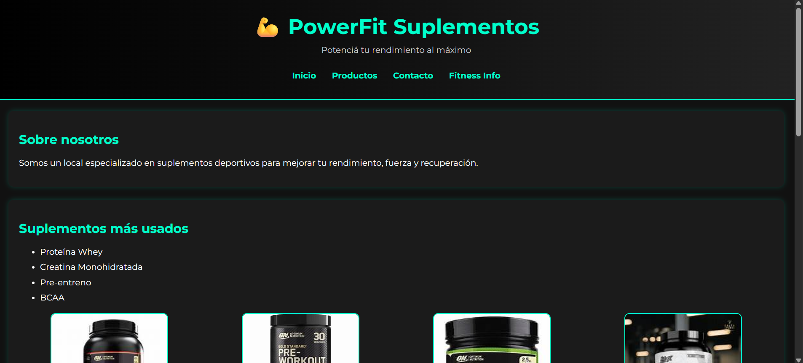
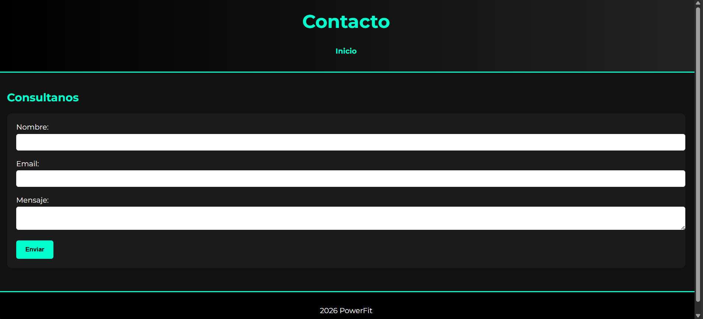

# PowerFit Suplementos

##  Descripción
Esta página se trata de mi portafolio personal, un sitio web de un local de venta de suplementos deportivos.

##  Contenido del sitio 
- Inicio  
- Productos  
- Contacto  
- Enlace externo a una página de fitness  

##  Tecnologías Utilizadas
- **HTML5:** Estructura semántica completa del sitio web.
- **CSS3:** Estilos avanzados, layouts modernos y diseño adaptativo.
- **Google Fonts:** Integración de la tipografía 'Montserrat'.
- **Git y GitHub:** Control de versiones y continuidad del repositorio.

##  Mejoras Visuales Incorporadas (Parte 2)
- **Variables CSS (:root):** Centralización de colores neón y fuentes globales para un mantenimiento eficiente.
- **Layout Moderno:** Implementación de **Flexbox** para centrar la navegación y **CSS Grid** para la grilla de productos.
- **Componentes Interactivos:** Efectos `hover` con sombras neón y transiciones suaves de `0.3s` en botones, enlaces y tarjetas.
- **Animaciones Avanzadas:** Uso de `@keyframes` para crear un efecto de pulso rítmico automático en el bloque de promociones.
- **Diseño Responsive:** Inclusión de Media Queries para adaptar la interfaz perfectamente a Tablets (768px) y Celulares (480px).

## 📸 Capturas del Proyecto
Aquí podés ver unas capturas de la interfaz de PowerFit funcionando en tiempo real:

## 👤 Autor
Agustín Zamer
